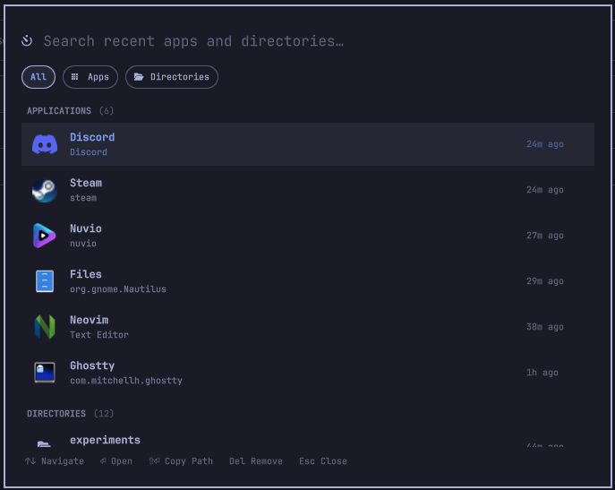

# Recents Commander

A lightweight, keyboard-first desktop extension and workflow accelerator for **Omarchy OS** (Quattro). 

Recents Commander tracks your recently used applications and recently visited directories, presenting them in a unified, searchable modal launcher inspired by the Omarchy application menu.



---

## Features

- **Unified Context:** Displays both recent Applications and Directories in distinct, clean sections.
- **Instant Search:** Real-time type-to-filter across apps, folder names, and paths.
- **Asynchronous & Low-Priority:** Zero UI blocking. In-memory event collection with a 5-second debounced background disk save.
- **Simplified Ergonomics:**
  - `↑` / `↓`: Navigate through items across sections.
  - `Enter`: Open selected item (launches app or opens folder in default file manager).
  - `Shift + Enter`: Copy directory path to clipboard.
  - `Del`: Remove an entry from history.
  - `Esc` / Scrim click: Dismiss modal.
- **Top Bar Integration:** Includes a top bar widget glyph (`󰄉`) to toggle the launcher with a click.
- **Hyprland Keybinding:** Seamless global shortcut trigger (e.g. `SUPER + SHIFT + SPACE`).

---

## Installation

### From the Omarchy Plugin Marketplace

Once published or using the direct git URL:

```bash
omarchy plugin add https://github.com/sudhir-asuracore/recents-commander.git
omarchy plugin enable io.github.omarchy.recents-commander
```

### Manual / Local Development Installation

1. Clone or symlink this directory into your Omarchy plugins configuration directory:

```bash
git clone https://github.com/sudhir-asuracore/recents-commander.git ~/.config/omarchy/plugins/io.github.omarchy.recents-commander
```

2. Validate the plugin structure:
```bash
omarchy plugin validate ~/.config/omarchy/plugins/io.github.omarchy.recents-commander
```

3. Enable the plugin:
```bash
omarchy plugin enable io.github.omarchy.recents-commander
omarchy-restart-shell
```

### Optional: Add Top Bar Widget
To add the glyph (`󰄉`) to your top bar (e.g. in the left or right section):

```bash
omarchy bar move io.github.omarchy.recents-commander --section left
```

### Keybinding Setup
In your Hyprland configuration (e.g. `~/.config/hypr/bindings.lua` or `bindings/utilities.lua`), add:

```lua
o.bind("SUPER + SHIFT + SPACE", "Recents Commander", "omarchy-recents toggle")
```

Ensure `bin/omarchy-recents` is accessible in your `$PATH` (e.g. symlinked to `~/.local/bin/omarchy-recents`):

```bash
ln -sf ~/.config/omarchy/plugins/io.github.omarchy.recents-commander/bin/omarchy-recents ~/.local/bin/omarchy-recents
```

### Clean Removal / Uninstallation

To completely and safely remove Recents Commander without leaving orphaned state or files:

```bash
# 1. Purge state directory and binary symlink
omarchy-recents purge

# 2. Disable and remove the plugin via Omarchy CLI
omarchy plugin disable io.github.omarchy.recents-commander
omarchy plugin remove io.github.omarchy.recents-commander --yes

# 3. Reload shell
omarchy-restart-shell
```

*(Optional: Remove the `SUPER + SHIFT + SPACE` line from `~/.config/hypr/bindings.lua` if configured).*

---

## Usage

| Action | Shortcut / Gesture |
|---|---|
| **Toggle Launcher** | `SUPER + SHIFT + SPACE` or click top bar icon |
| **Search** | Type characters directly |
| **Navigate** | `↑` / `↓` or `Home` / `End` |
| **Filter by Category** | `Tab` / `Shift + Tab` (All / Apps / Directories) |
| **Open Item** | `Enter` |
| **Copy Folder Path** | `Shift + Enter` (on directory items) |
| **Remove from History** | `Delete` |
| **Close** | `Escape` or click outside |

---

## Architecture & Design

- **Manifest:** [`manifest.json`](manifest.json) declares `kinds: ["bar-widget", "overlay", "service"]`.
- **Background Service:** [`Service.qml`](Service.qml) tracks new Wayland window creation (`ToplevelManager.toplevels.onValuesChanged`) to preserve MRU without focus pollution, resolves applications against desktop entries via `StartupWMClass` and app metadata, and harvests directories asynchronously via `zoxide` and GTK bookmarks.
- **Pure MRU Sorting:** Sorted strictly by `lastOpened` timestamp descending.
- **Asynchronous Persistence:** Debounced 5-second idle write timer prevents disk thrashing.
- **Modal Overlay:** [`RecentsCommander.qml`](RecentsCommander.qml) renders a centered Wayland LayerShell `PanelWindow` following Omarchy design system standards (`Color`, `Border`, `Style`).
- **Persistent Storage:** Stored in valid JSON format at:
  ```
  ~/.local/state/omarchy/recents-commander/recents.json
  ```

---

## License

This project is licensed under the [MIT License](LICENSE). Copyright (c) 2026 Omarchy Community Contributors.
